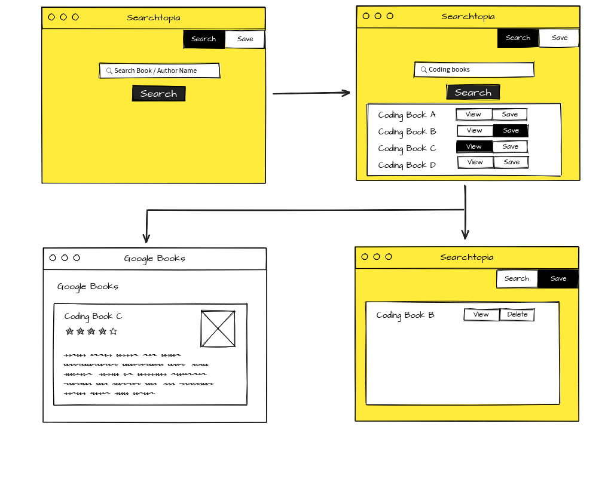

# Searchtopia

* Are you as curious as Bill Gates and love reading books? Want to keep a checklist list of all the books you want to read? Then this app is for you.

* This app lets you search for your desired book criteria from the Google's Books API and save it as your future checklist item.

## WireFrame

## Technologies Used

* MongoDB
* ExpressJS
* ReactJS
* NodeJs

* Axios
* Dotenv
* Heroku

## Demo

##  Live Website

https://gbooksrch.herokuapp.com/

* Enter the search criteria of key words for the book you are looking for.
* It will spit out the top ten results that match you search criteria.
* When clicked on 'save', the book is saved for future reference.
* When clicked on 'view', it will redirect you to the Google Books website on a new tab.

## Role

This app is developed by me, both Front End and Back End.

